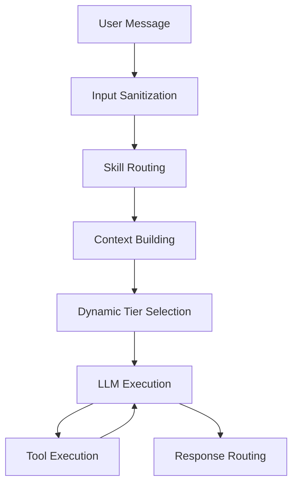

# GolemCore Bot

> **AI assistant framework with intelligent skill routing, multi-LLM support, and autonomous execution capabilities**

[](https://github.com/alexk-dev/golemcore-bot/actions/workflows/docker-publish.yml)
[](https://www.oracle.com/java/)
[](https://spring.io/projects/spring-boot)
[](LICENSE)
[](https://github.com/alexk-dev/golemcore-bot/actions)

---

## 🚀 Key Features

### 🧠 Intelligent Processing
- **Hybrid Skill Routing** — 2-stage semantic search + LLM classifier for precise intent matching.
- **Dynamic Model Tier Selection** — Automatically upgrades to coding-tier models (e.g., o1/Sonnet) when complex tasks are detected.
- **Context Overflow Protection** — Smart truncation with emergency recovery for infinite conversations.

### 🛠️ Powerful Tooling
- **12 Built-in Tools** — Filesystem, Shell, Web Search, Browser, Weather, IMAP, SMTP, Memory, and more.
- **MCP Support** — Native client for [Model Context Protocol](https://modelcontextprotocol.io/) (connect GitHub, Slack, Drive, etc.).
- **Sandboxed Execution** — Isolated workspace with path traversal protection and command blocklists.

### 🔄 Autonomous Capabilities
- **Auto Mode** — Goal-driven execution where the bot proactively plans tasks, executes them, and maintains a diary.
- **Skill Pipelines** — Chain skills together (e.g., `Code Review` → `Test Runner` → `Debugger`).
- **RAG Integration** — Long-term semantic memory via LightRAG knowledge graphs.

---

## ⚡ Quick Start

### 1. Docker (Recommended)

Run the bot with a single command. By default, it exposes port 8080.

```bash
docker run -d \
  --name golemcore-bot \
  --restart unless-stopped \
  --shm-size=256m \
  --cap-add=SYS_ADMIN \
  -p 8080:8080 \
  -v golemcore-data:/app/workspace \
  -e OPENAI_API_KEY="sk-..." \
  -e ANTHROPIC_API_KEY="sk-..." \
  -e TELEGRAM_ENABLED=true \
  -e TELEGRAM_BOT_TOKEN="123456:ABC-DEF..." \
  -e TELEGRAM_ALLOWED_USERS="123456789" \
  golemcore-bot:latest
```

> **Note:** `--shm-size=256m` and `--cap-add=SYS_ADMIN` are required for the Browser tool (Playwright).

### 2. Docker Compose

Create `docker-compose.yml` for a production-ready setup:

```yaml
version: '3.8'
services:
  golemcore-bot:
    image: golemcore-bot:latest
    container_name: golemcore-bot
    restart: unless-stopped
    shm_size: '256m'
    cap_add:
      - SYS_ADMIN
    environment:
      # --- LLM Providers (at least one required) ---
      OPENAI_API_KEY: ${OPENAI_API_KEY}
      ANTHROPIC_API_KEY: ${ANTHROPIC_API_KEY:-}

      # --- Telegram Integration ---
      TELEGRAM_ENABLED: true
      TELEGRAM_BOT_TOKEN: ${TELEGRAM_BOT_TOKEN}
      TELEGRAM_ALLOWED_USERS: ${TELEGRAM_ALLOWED_USERS} # Comma-separated IDs

      # --- Optional Features ---
      AUTO_MODE_ENABLED: "false"        # Enable autonomous goal execution
      RAG_ENABLED: "false"              # Enable long-term memory
      MCP_ENABLED: "true"               # Enable Model Context Protocol
    volumes:
      - ./workspace:/app/workspace
    ports:
      - "8080:8080"
```

### 3. Java JAR

```bash
# Build
./mvnw clean package -DskipTests

# Run
export OPENAI_API_KEY=sk-...
java -jar target/golemcore-bot-*.jar
```

---

## 📚 Documentation

| Guide | Description |
|-------|-------------|
| **[Configuration](docs/CONFIGURATION.md)** | Full list of 90+ environment variables and settings. |
| **[Model Routing](docs/MODEL_ROUTING.md)** | How the bot selects models and handles context. |
| **[Auto Mode](docs/AUTO_MODE.md)** | Autonomous goals, tasks, and diary system. |
| **[Memory & RAG](docs/MEMORY.md)** | Short-term sessions and long-term knowledge graph. |
| **[Deployment](docs/DEPLOYMENT.md)** | Systemd, Docker, and production best practices. |
| **[Contributing](CONTRIBUTING.md)** | Development workflow, testing, and code style. |

---

## 🛠️ Tools & Integrations

The bot comes with a powerful suite of tools. Access them via skills or natural language.

| Category | Tools | Description |
|----------|-------|-------------|
| **System** | `Filesystem`, `Shell` | Safe file operations and command execution. |
| **Web** | `Browser`, `BraveSearch`, `Weather` | Browse pages, search the web, check weather. |
| **Comm** | `IMAP`, `SMTP`, `SendVoice` | Read/send emails, generate voice responses. |
| **Agent** | `GoalManagement`, `SkillManagement` | Manage autonomous goals and custom skills. |
| **MCP** | *External Tools* | Connect any [MCP Server](https://modelcontextprotocol.io/) (GitHub, Slack, etc.). |

### MCP Example
To add GitHub capabilities, define a skill with MCP configuration:
```yaml
---
name: github-manager
mcp:
  command: npx
  args: ["-y", "@modelcontextprotocol/server-github"]
  env:
    GITHUB_PERSONAL_ACCESS_TOKEN: ${GITHUB_TOKEN}
---
You are a GitHub expert. Manage issues and PRs.
```

---

## 🏗️ Architecture

The bot uses a pipeline architecture to process every message:



1.  **Skill Routing**: Hybrid search (Semantic + Classifier) determines the best skill.
2.  **Tier Selection**: Analyzes complexity to choose the cheapest effective model (e.g., GPT-4o Mini vs. O1).
3.  **Execution Loop**: Iteratively calls tools (up to 20 steps) to solve the task.

---

## 💻 Development

We welcome contributions! Please see **[CONTRIBUTING.md](CONTRIBUTING.md)** for details on:
*   Project structure
*   Running tests (`mvn test`)
*   Code quality checks (PMD, SpotBugs)
*   Pre-commit hooks

**Quick Build:**
```bash
./mvnw clean verify -P strict
```

---

## 📄 License

This project is licensed under the **Apache License 2.0**.
See [LICENSE](LICENSE) for details.

<div align="center">
  <sub>Made with ☕ and 🤖 by <a href="https://github.com/alexk-dev">alexk-dev</a></sub>
</div>
